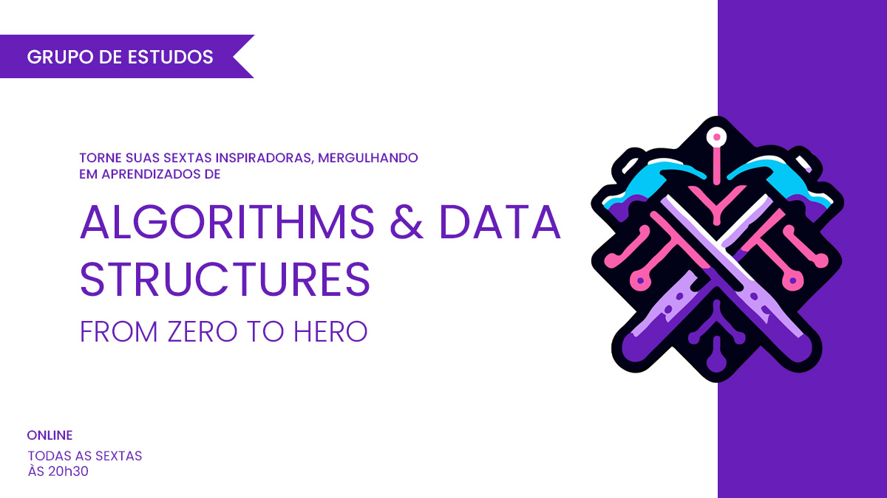
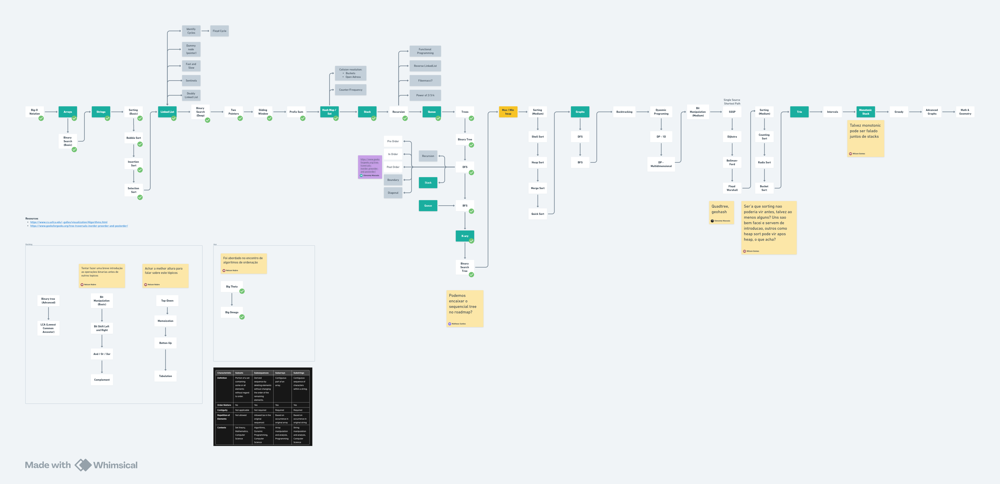

# Algorithms &amp; Data Structures - From Zero to Hero

Este repositório é destinado a serie da nossa comunidade **Craft & Code Club** sobre **Algorithms &amp; Data Structures - From Zero to Hero**.

Vamos usar este repositorio para compartilhar o roadmap, códigos, slides e materiais de apoio aos nossos encontros.

## Sobre a série

- [YouTube Playlist](https://www.youtube.com/watch?v=MtLv9Rwb55Q&list=PLl10TyPY67Jgbh4QdRlRKr-7PjB9i5hWg)
- [Meetup](https://www.meetup.com/craft-code-club/events/)

## Contrubuições

Todas as contribuições são bem-vindas.

- Se tens alguma sugestão ou correção, por favor, abra uma issue deste repositório.
- Se encontraste algum erro ou algo que possa ser melhorado, por favor, abra um pull request.

## Roadmap

[Preview Roadmap](https://whimsical.com/roadmap-BVA8gnSNM2D296qmrjwvY4)

- [x] **Big O Notation - Análise Assintótica de Algoritmos**
  - [Youtube - Encontro](https://www.youtube.com/watch?v=MtLv9Rwb55Q)

- [x] **Arrays**
  - [Youtube - Encontro](https://www.youtube.com/watch?v=c95xvXCU34A)

- [x] **Strings**
  - [Youtube - Encontro](https://www.youtube.com/watch?v=B9CCEwjoXBk)

- [x] **Algoritmos de Ordenação Básicos**
  - [Youtube - Encontro](https://www.youtube.com/watch?v=GxhxsbbzaTI)
  - Topicos:
    - [Bubble Sort](https://github.com/NelsonBN/algorithms-data-structures-bubble-sort)
    - [Insertion Sort](https://github.com/NelsonBN/algorithms-data-structures-insertion-sort)
    - [Selection Sort](https://github.com/NelsonBN/algorithms-data-structures-insertion-sort)

- [x] **Linked Lists**
  - [Youtube - Encontro](https://www.youtube.com/watch?v=j0E5hJZ__EA)
  - Topicos:
    - [Singly Linked List](https://github.com/NelsonBN/algorithms-data-structures-linked-list/blob/main/src/singly_linked_list.py)
      - [Operations](https://github.com/NelsonBN/algorithms-data-structures-linked-list/blob/main/src/singly_linked_list_operations.py)
      - [Operations Optimized](https://github.com/NelsonBN/algorithms-data-structures-linked-list/blob/main/src/singly_linked_list_operations_optimized.py)
    - Doubly Linked List
    - Sentinels
    - Dummy node (pointer)
    - [Rotate Linked List](https://github.com/NelsonBN/algorithms-data-structures-linked-list/blob/main/src/rotate_linked_list.py)
      - [Visualização](https://github.com/NelsonBN/algorithms-data-structures-linked-list/raw/main/media/reversing_linked_list.webp)
    - [Fast and Slow Pointer](https://github.com/NelsonBN/algorithms-data-structures-linked-list/blob/main/src/fast_and_slow_pointer.py)
    - [Identify Cycles](https://github.com/NelsonBN/algorithms-data-structures-linked-list/blob/main/src/identifying_cycles.py)
    - [Floyd Cycle](https://github.com/NelsonBN/algorithms-data-structures-linked-list/blob/main/src/floyd_cycle.py)

- [x] **Binary Search**
  - [Youtube - Encontro](https://www.youtube.com/watch?v=62ZGcXDpbys)
  - [Demo](https://github.com/NelsonBN/algorithms-data-structures-binary-search)

- [x] **Two Pointers**
  - [Youtube - Encontro](https://www.youtube.com/watch?v=a1QMdXgcQwY)

- [x] **Sliding Window**
  - [Youtube - Encontro](https://www.youtube.com/watch?v=OvIJw1AMNzI)
  - Exercicios:
    - Fixed Window -> [1343. Number of Sub-arrays of Size K and Average Greater than or Equal to Threshold](https://leetcode.com/problems/number-of-sub-arrays-of-size-k-and-average-greater-than-or-equal-to-threshold/description/)

- [x] **Prefix Sum**

- [x] **Hash Map / Set**
  - [Demo](https://github.com/NelsonBN/algorithms-data-structures-hashtable)
- [ ] **Stack**
- [ ] **...**

## Status

