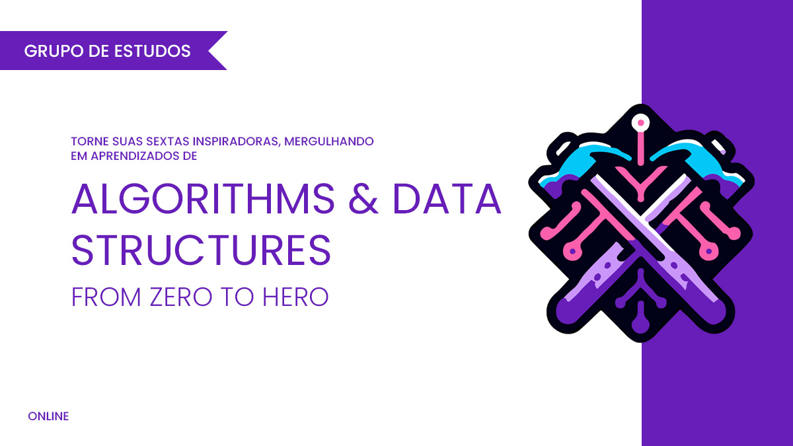

# Algorithms &amp; Data Structures - From Zero to Hero

Este repositório é destinado a serie da nossa comunidade **Craft & Code Club** sobre **Algorithms &amp; Data Structures - From Zero to Hero**.

Vamos usar este repositorio para compartilhar o roadmap, códigos, slides e materiais de apoio aos nossos encontros.

## Sobre a série

-   [YouTube Playlist](https://www.youtube.com/watch?v=MtLv9Rwb55Q&list=PLl10TyPY67Jgbh4QdRlRKr-7PjB9i5hWg)
-   [Meetup](https://www.meetup.com/craft-code-club/events/)

## Contrubuições

Todas as contribuições são bem-vindas.

-   Se tens alguma sugestão ou correção, por favor, abra uma issue deste repositório.
-   Se encontraste algum erro ou algo que possa ser melhorado, por favor, abra um pull request.

## Roadmap

-   [x] **Big O Notation - Análise Assintótica de Algoritmos**
    -   [Youtube - Encontro](https://www.youtube.com/watch?v=MtLv9Rwb55Q)

-   [x] **Arrays**
    -   [Youtube - Encontro](https://www.youtube.com/watch?v=c95xvXCU34A)

-   [x] **Strings**
    -   [Youtube - Encontro](https://www.youtube.com/watch?v=B9CCEwjoXBk)

-   [x] **Algoritmos de Ordenação Básicos**
    -   [Youtube - Encontro](https://www.youtube.com/watch?v=GxhxsbbzaTI)
    -   Topicos:
        -   [Bubble Sort](https://github.com/NelsonBN/algorithms-data-structures-bubble-sort)
        -   [Insertion Sort](https://github.com/NelsonBN/algorithms-data-structures-insertion-sort)
        -   [Selection Sort](https://github.com/NelsonBN/algorithms-data-structures-insertion-sort)

-   [x] **Linked Lists**
    -   [Youtube - Encontro](https://www.youtube.com/watch?v=j0E5hJZ__EA)
    -   Topicos:
        -   [Singly Linked List](https://github.com/NelsonBN/algorithms-data-structures-linked-list/blob/main/src/singly_linked_list.py)
            -   [Operations](https://github.com/NelsonBN/algorithms-data-structures-linked-list/blob/main/src/singly_linked_list_operations.py)
            -   [Operations Optimized](https://github.com/NelsonBN/algorithms-data-structures-linked-list/blob/main/src/singly_linked_list_operations_optimized.py)
        -   Doubly Linked List
        -   Sentinels
        -   Dummy node (pointer)
        -   [Rotate Linked List](https://github.com/NelsonBN/algorithms-data-structures-linked-list/blob/main/src/rotate_linked_list.py)
            -   [Visualização](https://github.com/NelsonBN/algorithms-data-structures-linked-list/raw/main/media/reversing_linked_list.webp)
        -   [Fast and Slow Pointer](https://github.com/NelsonBN/algorithms-data-structures-linked-list/blob/main/src/fast_and_slow_pointer.py)
        -   [Identify Cycles](https://github.com/NelsonBN/algorithms-data-structures-linked-list/blob/main/src/identifying_cycles.py)
        -   [Floyd Cycle](https://github.com/NelsonBN/algorithms-data-structures-linked-list/blob/main/src/floyd_cycle.py)

-   [x] **Binary Search**
    -   [Youtube - Encontro](https://www.youtube.com/watch?v=62ZGcXDpbys)
    -   [Demo](https://github.com/NelsonBN/algorithms-data-structures-binary-search)

-   [x] **Two Pointers**
    -   [Youtube - Encontro](https://www.youtube.com/watch?v=a1QMdXgcQwY)

-   [x] **Sliding Window**
    -   [Youtube - Encontro](https://www.youtube.com/watch?v=OvIJw1AMNzI)
    -   Exercicios:
        -   Fixed Window -> [1343. Number of Sub-arrays of Size K and Average Greater than or Equal to Threshold](https://leetcode.com/problems/number-of-sub-arrays-of-size-k-and-average-greater-than-or-equal-to-threshold/description/)

-   [x] **Prefix Sum**
    -   [Youtube - Encontro](https://www.youtube.com/watch?v=yMnLofkS7DM)

-   [x] **Hash Map / Set**
    -   [Youtube - Encontro](https://www.youtube.com/watch?v=JFhdCBrKTX0)
    -   [Demo](https://github.com/NelsonBN/algorithms-data-structures-hashtable)

-   [x] **Stack**
    -   [Youtube - Encontro](https://www.youtube.com/watch?v=JRbrNgsYuT0)
    -   [Demo](https://github.com/matheusses/dsa/tree/main/src/stack)
    -   Exercicios:
        -   [20. Valid Parentheses](https://leetcode.com/problems/valid-parentheses/description/)
        -   [1544. Make The String Great](https://leetcode.com/problems/make-the-string-great/description/)

-   [x] **Recursividade**
    -   Fundamentos
        -   [Youtube - Encontro](https://www.youtube.com/watch?v=KkSAaQHCkSE)
        -   [Demo](https://github.com/NelsonBN/algorithms-data-structures-recursion)
    -   Paradigma Funcional
        -   [Youtube - Encontro](https://www.youtube.com/watch?v=rbEYjJdaIZI)
        -   [Demo](./src/functional-recursion/README.md)

-   [x] **Queue**
    -   [Youtube - Encontro](https://www.youtube.com/watch?v=KJaVKLZsMcg)
    -   [Demo](https://github.com/NelsonBN/algorithms-data-structures-queue)
    -   Exercicios:
        -   [232. Implement Queue using Stacks](https://leetcode.com/problems/implement-queue-using-stacks/description/)

-   [x] **Tree**
    -   [Youtube - Encontro](https://www.youtube.com/watch?v=OAcm2rXqz9M)

-   [x] **Tree Traverse**
    -   [Youtube - Encontro](https://www.youtube.com/watch?v=_-2F65OVWjo)
    -   [Code Implementation examples in Go](https://github.com/giovannymassuia/DS-A/tree/main/go-dsa/tree)

-   [x] **k-ary tree**
    -   [Youtube - Encontro](https://www.youtube.com/watch?v=FLZxMQFTqvY)
    -   [Code Implementation examples in Go](https://github.com/giovannymassuia/DS-A/tree/main/go-dsa/tree/k_ary)

-   [x] **Binary Search Tree**
    -   [Youtube - Encontro](https://www.youtube.com/watch?v=CITquySB4ls)
    -   [Demo](https://github.com/NelsonBN/algorithms-data-structures-binary-search-tree)
    -   [Playground](https://www.cs.usfca.edu/~galles/visualization/BST.html)

-   [x] **Binary Heap**
    -   [Youtube - Encontro](https://www.youtube.com/watch?v=HVWw20nOLHk)
    -   [Demo](https://github.com/NelsonBN/algorithms-data-structures-binary-heap)

-   [x] **Algoritmos de Ordenação Básicos - Heap Sort**
    -   [Youtube - Encontro](https://www.youtube.com/watch?v=wUfOyKMjamM)
    -   [Demo](https://github.com/NelsonBN/algorithms-data-structures-heap-sort)

-   [ ] **Algoritmos de Ordenação Básicos - Merge Sort**
    -   [Youtube - Encontro](https://www.youtube.com/watch?v=lbktBOwmmhg)
    -   [Demo - Merge Sort](https://github.com/NelsonBN/algorithms-data-structures-merge-sort)
    -   [Demo - Stable Vs. Unstable Sorting Algorithms](https://github.com/NelsonBN/algorithms-data-structures-stable-vs-unstable-sort-algos)

-   [x] **Algoritmos de Ordenação Básicos - Shell Sort**
    -   [Youtube - Encontro](https://www.youtube.com/watch?v=symbT7Cgrr8)
    -   [Demo](https://github.com/NelsonBN/algorithms-data-structures-shell-sort)

-   [x] **Algoritmos de Ordenação Básicos - Quick Sort**
    -   [Youtube - Encontro](https://www.youtube.com/watch?v=2T0Itw-oaEA)
    -   [Demo](https://github.com/NelsonBN/algorithms-data-structures-quick-sort)

-   [x] **Algoritmos de Ordenação Básicos - Introdução a Grafos**
    -   [Youtube - Encontro - Part I](https://www.youtube.com/watch?v=cILrU-dtuEc)
    -   [Youtube - Encontro - Part II](https://www.youtube.com/watch?v=IP0C0qCYWIc)

-   [ ] **...**

## Status

